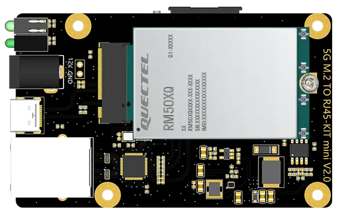

Quectel RGMII Configuration Notes
=================================

Many of Quectel's modems support directly connecting to a PCIe Ethernet chipset. This is useful to use the cellular connection as a WAN interface - you can just plug the modem into the WAN port on your router, do a bit of configuration, and you're good to go. Performance is good, and the modem's onboard connection management often works better than the scripts many routers use to try to keep the connection up.

Downsides are that it's more difficult to monitor the connection state, and, well, that's about it!

> :warning: **WARNING**: This documentation is incomplete! I will try to get back to finish it up later; otherwise, pull requests are accepted!

# Table of Contents
- [Quectel RGMII Configuration Notes](#quectel-rgmii-configuration-notes)
- [Table of Contents](#table-of-contents)
- [Hardware Recommendations](#hardware-recommendations)
- [Basic configuration](#basic-configuration)
  - [Additional notes](#additional-notes)
  - [AT over Ethernet](#at-over-ethernet)
  - [Enabling IP Passthrough](#enabling-ip-passthrough)
    - [QMAP Method](#qmap-method)
    - [RGMII Method](#rgmii-method)
  - [Specifying a custom APN](#specifying-a-custom-apn)
  - [Changing modem IP address with AT command](#changing-modem-ip-address-with-at-command)
- [Advanced configuration](#advanced-configuration)
  - [Getting ADB Access](#getting-adb-access)
  - [Changing modem IP address](#changing-modem-ip-address)
  - [TTL Modification](#ttl-modification)

# Hardware Recommendations

I've only used one adapter personally; it's sold on Aliexpress as "5G M.2 To RJ45", and can either be purchased as a bare board or as a kit including an enclosure, pigtails, and antennas (all of dubious quality.)

The only labelling on the board is:
```5G M.2 TO RJ45-KIT mini V2.0```
As this is Aliexpress, there is no guarantee that the board will be the same when purchased from other sellers, or even the same seller.



Here's the seller I purchased from:
https://www.aliexpress.us/item/3256804672394777.html

Note that the descriptions all say gigabit, but the board that I (and others) received actually has the RTL8125 ethernet chipset, and works at 2.5gbit. Woohoo!

The kit I linked above does include a heatsink. However, the enclosure doesn't allow any airflow, so the modem gets quite hot; I am running mine without the top on, and it does fine. It's also quite difficult to get the pieces of the case separated for the first time; I ended up using a putty knife to gently pry it apart (but be sure to pull the SIM tray first.) The SIM slot uses a standard "Mini SIM", and the tray is a pain to eject; I have been using the putty knife to pull that open too.

You can install a 12V fan using the "12V/GND" PINs between the barrel connector and the PCIe slot.

Side note - this is the same adapter that is/was used in early versions of the Invisagig product sold by Wireless Haven. Their product comes ready to go, in a larger case, including a 12V fan and a SIM card extender to make the sim card easier to deal with. They embed a custom GUI in the RM520N, which makes configuration simpler, no need for a USB connection at all. It's expensive compared to DIY, but they also offer a warranty and support. If you're interested:
https://thewirelesshaven.com/shop/modems-hotspots/invisagig/

(If you are using an Invisagig, please don't do any of the stuff mentioned below. Use their UI, or ask for support instead. You're paying a premium to not have to deal with this.)

# Basic configuration

It doesn't take much to get this going!

```
AT+QCFG="data_interface",1,0
AT+QCFG="pcie/mode",1
AT+QETH="eth_driver","r8125",1
AT+QMAPWAC=1
```

What these commands do:
* `AT+QCFG="data_interface"`: Configures network port/diag port communication via PCIe and USB. First parameter is for network communication; 0 is USB and 1 is PCIe. Second parameter is for diagnostics port; only option is 0 for USB.
* `AT+QCFG="pcie/mode"`: 1 = RC (Root Complex), IE host. 0 = EP (Endpoint), for use in a device that has the RC
* `AT+QETH="eth_driver","r8125",1`: This configures which ethernet driver to load at module boot. You can run `AT+QETH="eth_driver"` to get a list of options; I believe only one can be enabled. The first parameter is the name of the driver, and the second parameter is a bool to enable or disable.

If you want to be able to send AT commands via Ethernet, you can also add:
```
AT+QETH="eth_at","enable"
```

This will enable an AT interface on port 1555. See below section [AT over Ethernet](#at-over-ethernet) for more details.

..and then reboot the module with `AT+CFUN=1,1`.

## Additional notes

It looks like there are multiple ways to configure these modules. This is the most widely-referenced method I've seen referenced, including in Quectel's documentation for the M.2 EVB board. Similar methods of configuring this feature appear to be `AT+QETH="rgmii"` and various functions of `AT+QMAP`. If someone has a good understanding of which mode to use when, please open an issue or pull request!

## AT over Ethernet

If you enabled AT over Ethernet, anyone behind the modem will be able to send whatever AT commands they want to it -- there is no authentication for the protocol. Just to warn ya.

Their interface is not like the Netgear Nighthawk interface, where you can just telnet into the port and start issuing commands; they use a not-complex-but-not-telnet protocol. They don't have official docs on it, and just released a sample C application. I have a hacked-up Python script that is a bit easier to use, available at:
https://github.com/natecarlson/quectel-rgmii-at-command-client

## Enabling IP Passthrough

By default, the modem acts as a true NAT router for IPv4, and serves addresses via IPv6. The modem's IPv4 address is 192.168.225.1 - this can't be changed via AT commands (and Quectel doesn't officially support changing it), but it is possible - see Advanced below.

In any case, if you want to pass through the IPv4 (and possibly IPv6? Not sure if the modem passes through the v6 address and lets you use the delegated subnet behind your router or not; I will have to test.) addresses that are assigned, you can!

As with enabling ethernet mode to start with, it appears there are multiple ways to enable IP Passthrough.

> :warning: **BE CAREFUL**: I haven't managed to get either of these methods to work properly in my testing yet. If you have, feel free to share!

### QMAP Method

> :warning: **BE CAREFUL**: I haven't managed to get either of these methods to work properly in my testing yet. If you have, feel free to share!

This is the method that is documented in the RM520N AT command manual that I have, so I've tested this method.

To enable IP passthrough:
```
at+qmap="mpdn_rule",0,1,1,1,1,"FF:FF:FF:FF:FF:FF"
```

Parameters:
* First = mPDN rule number, range 0-3 (unless you're doing something complicated, you'll use 0.)
* Second = APN Profile ID (CGDCONT) to use. You'll probably want 1.
* Third = IP Passthrough mode. 0 = disabled, 1 = enabled for ethernet, 2 = enabled for WiFi, 3 = enabled for USB-ECM/RNDIS. You'll probably want 1.
* Fourth = autoconnect. Use 1.
* Fifth = IPPT Mode. If set to 0, disabled? 1 or 2 make the next field the MAC address you want to pass through to. If you don't specify this, but have IPPT enabled, the first computer to connect will get the pass-through address, and any additional computers will get a private NAT'd IP.
* Sixth = MAC address to pass through to. `FF:FF:FF:FF:FF:FF` will select the first host that gets a DHCP lease.


### RGMII Method

> :warning: **BE CAREFUL**: I haven't managed to get either of these methods to work properly in my testing yet. If you have, feel free to share!

If we were using `AT+QETH="rgmii"` to enable Ethernet mode, we'd probably want to use that for this too. Note that this mode is documented in the AT command guide for the older RM50x modules, and is not documented in the AT command guide for the RM520 modules - at least the versions of the manuals I have.

If you want to go that route, you can try:

```
AT+QETH="ipptmac",XX:XX:XX:XX:XX:XX
AT+QETH="rgmii","ENABLE",1,1,1
```
* AT+QETH="ipptmac", the first parameter, formatted as `XX:XX:XX:XX:XX:XX`, should be the MAC address of the device you want to receive the IP passthrough.
* AT+QETH="rgmii":
  * First parameter is "ENABLE" or "DISABLE", to enable or disable RGMII mode.
  * Second parameter is the voltage to use for RGMII. `0`=1.8v and `1`=2.5v. I would recommend running `AT+QETH="rgmii"`, and get the current version from the first line it prints: `+QETH: "RGMII","DISABLE",1,-1` -- it's the '1' after the disable.
  * Third parameter is for IP Passthrough. `-1` = no data call, `0` = COMMON-RGMII (not passthrough), `1` = IP Passthrough-RGMII
  * Optional fourth parameter is if you want to specify a CGDCONT profile to use for this. `0` = not configured, `1` = configured.
  * Optional fifth parameter is the CGDCONT profile ID, 1-8.

## Specifying a custom APN

If the modem doesn't automatically connect, it's likely that you need to manually configure the APN. It's done the same way that you configure the APN on the modem when using it via USB/etc.

> :warning: **TODO**: Finish filling out this section!

## Changing modem IP address with AT command

There are plenty of reasons that you might need to change the IP of the modem.. IE, you might have multiple modems connected to the same router for WAN load balancing or bonding, or it might conflict with your internal network IP ranges, or (other reasons.) On recent modems, Quectel does have a command to do this!

The command is:
```
AT+QMAP="LANIP",<dhcp-start>,<dhcp-end>,<router-ip>,<apply?>
AT+QMAP="LANIP",192.168.227.20,192.168.227.100,192.168.227.1,1
```

The 'apply?' is if the router should apply the changes immediately, or wait until reboot.

# Advanced configuration

These modems are a full-fledged Linux router under the hood. Once you've got access, you can modify anything you want on the filesystem. It's pretty cool, and also kind of dangerous.. but neat. The access is via 'adb' - the same tool used to do fun stuff to Android phones.

## Getting ADB Access

To get access, you need to get a key salt from the modem, get the result from Quectel, unlock the modem, and then enable ADB.

To get the key, run the AT command "AT+QADBKEY?". The modem will reply with:
```
AT+QADBKEY?
+QADBKEY: 12345678
OK
```

You then can head over to the Quectel forums (https://forums.quectel.com/), create an account, and post asking for the key. There are also tools available on the great wide internet that will generate the key for previous modems.. but they don't quite work for RM5XX's; the result is a little bit too long.

Once you have received the unlock key, you apply it like:
```
AT+QADBKEY="0jXKXQwSwMxYoeg"
```

Then, to actually enable ADB, run `AT+QCFG="usbcfg"`, take the output, change the second-to-last 0 to 1, and then send the new usbcfg string to the modem (do _NOT_ just copy/paste what's below; the USB VID/PID for your modem are very likely different):
```
AT+QCFG="usbcfg"
+QCFG: "usbcfg",0x2C7C,0x0801,1,1,1,1,1,0,0 // Initial response
AT+QCFG="usbcfg",0x2C7C,0x0801,1,1,1,1,1,1,0 // Enable ADB
```
And reboot with `AT+CFUN=1,1` to actually apply.

Once the modem is back online, you should be able to use ADB to manage the modem on the host connect to it with USB. Basic commands:
* `adb shell` - root shell on the modem
* `adb pull /path/to/file` - download a file from the modem
* `adb push /path/to/file` - upload a file to the modem

## Changing modem IP address

**NOTE**: I am leaving this here for reference sake, but on modern modems, you can indeed change the IP with an AT command. Please reference: [Changing modem IP address with AT command
](#changing-modem-ip-address-with-at-command)

There are plenty of reasons that you might need to change the IP of the modem.. IE, you might have multiple modems connected to the same router for WAN load balancing or bonding, or it might conflict with your internal network IP ranges, or (other reasons.) Unfortunately, Quectel doesn't officially support this, and there is no AT command to do so. However, it's not hard to do.

Make sure you've gained ADB access as described above.

WARNING: You're modifying files on the modem's root filesystem here. If you break it, you buy it, and can keep both pieces!

1. Log into the modem via `adb shell` (If you have multiple modems connected via USB that have ADB enabled, you can get a list of modems with `adb devices`, and connect to the one you want via `adb -s <number> shell`)
2. Change to the `/etc` directory
3. Open `/etc/data/mobileap_cfg.xml` in an editor, and change each occurence of 192.168.225 to whatever you want - for mine, I just went to 192.168.226.
4. Exit ADB, and reboot the router with `AT+CFUN=1,1`

Note that the 192.168.225.1 address is also referenced in `/etc/ql_nf_preload.conf`; I haven't modified that file and everything seems to work, but just so ya know.

## TTL Modification

This is a Linux router using iptables - so you can add iptables rules to override the outgoing TTL. Certain cell plans may require this for various reasons.

It's probably worth noting that this will also work for modems connected via a USB enclosure.. what this does is directly change the TTL/HL when packets leave the modem, so it really doesn't matter how it's connected to your network.

Make sure you've gained ADB access as described above.

WARNING: You're modifying files on the modem's root filesystem here. If you break it, you buy it, and can keep both pieces!

Files:
* `files/ttl-override`: A simple shell script to start/stop the TTL override. Set the desired TTL with the 'TTLVALUE=' at the top of the script; the default is 64, which will make all packets appear as coming from the modem itself.
* `files/ttl-override.service`: A systemd service to start said script

### Installing TTL Override:

* Mount the root filesystem read-write:
```
adb shell mount -o remount,rw /
```
* Push the files to the system:
```
adb push ttl-override /etc/initscripts
adb push ttl-override.service /lib/systemd/system
```
* symlink the systemd unit, reload systemd, start the service, and remount root as ro again:
```
adb shell chmod +x /etc/initscripts/ttl-override
adb shell ln -s /lib/systemd/system/ttl-override.service /lib/systemd/system/multi-user.target.wants/
adb shell systemctl daemon-reload
adb shell systemctl start ttl-override
adb shell mount -o remount,ro /
```
* The TTL rules will already be active - but you can reboot the modem with `AT+CFUN=1,1` and verify that the rules are automatically added at startup.
* After it comes back up, you can verify the TTL:
```
$ adb shell iptables -t mangle -vnL | grep TTL
 1720  107K TTL        all  --  *      rmnet+  0.0.0.0/0            0.0.0.0/0            TTL set to 64
$ adb shell ip6tables -t mangle -vnL | grep HL
    0     0 HL         all      *      rmnet+  ::/0                 ::/0                 HL set to 64
```

If you want to validate that it's working, you can use "adb shell", and run tcpdump on the network-side interface, specifying that interface's IP as the source (feel free to do that instead of pasting my long ugly string):
```
/ # tcpdump -s0 -v -n -i rmnet_data1 src `ip addr show dev rmnet_data1 | grep '^    inet ' | awk '{ print $2 }' | awk -F'/' '{ print $1 }'`
tcpdump: listening on rmnet_data1, link-type LINUX_SLL (Linux cooked v1), capture size 65535 bytes
17:12:03.064808 IP (tos 0x0, ttl 64, id 55285, offset 0, flags [DF], proto ICMP (1), length 212)
    10.200.255.210 > 8.8.4.4: ICMP echo request, id 16940, seq 2, length 192
```

Note the "ttl 64" - it's working, yay! (The traffic needs to be coming from a host behind the modem for it to really count, which this was.)

### Removing TTL Override

If, for some reason, you want to remove the TTL override, you would need to run:
```
adb shell /etc/initscripts/ttl-override stop
adb shell mount -o remount,rw /
adb shell rm -v /etc/initscripts/ttl-override /lib/systemd/system/ttl-override.service /lib/systemd/system/multi-user.target.wants/ttl-override.service
adb shell mount -o remount,ro /
adb shell systemctl daemon-reload
```
..no need to reboot.
